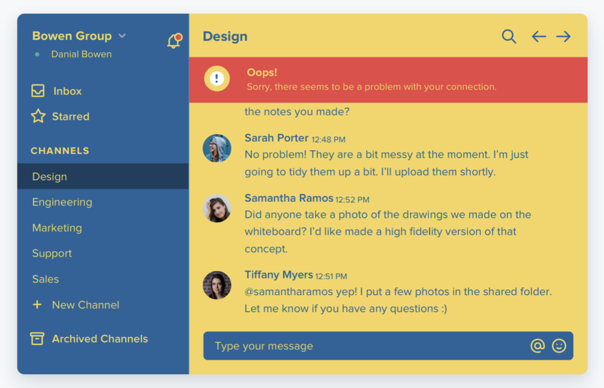

# Sharing the Good News

**About Design Systems**

<!-- 

Thanks you's: 
- Thank Heather and Bitovi
- Thanks Jessica and Slolam Build 

IMPORTANT NOTE: No Questions!  Keep time for networking at the end!

Comment: Hi!  I'm Shea Leslein, and I'm here to share the good news about design systems with you!

Comment:  Lets get Started!

-->

---

<!-- # About Me

Fam: Married 16 years, 4 kids, 15, 14, 12, 10

Comment: I think community is SO important.  
  - Thank Heather for coordinating our meetings and Jessica and the folks here at Soloam Build for hosting

    
Joke: The title of this talk as actually inspired by something my Pastor said during a sermon. So, if you ever meet Pastor Adam waters, from Grace Bible Church, please don't tell him I day dream during his sermons :smile:

Comment:  Now, I also like listening to podcasts when I walk the dog.  This seemingly random fact plays a key role in the story I will share today.

 
Personal Stuff:
- Meet the Fam!
- Community & Church
- Walks and Software Podcasts

---

 -->

# About Me: Professional Stuff

<!--
Comment:  Professionally, I realize nobody probably cares where I went to school, or when.  But I am a proud Iowan, and I am old.... I mean... I'm quite experienced...

Comment: Nearly 20 years to be more precise. Mostly as a full stack developer.  Currently I'm a lead engineer at FreeWheel, and Ad-tech company. 

Comment: As we move forward, I want to make one thing VERY clear.
-->

- **Education:** 2004 Iowa State University Grad. w/ B.A. Info. Systems 
- **Experience:** Nearly 20 Years as “Full-Stack” Developer
- **Current Role:** Lead Software Engineer @ FreeWheel

<!-- _class: lead -->
_**I want thing VERY CLEAR ...**_

---

<!-- 
 # I'm not a designer

Comment: I'm pretty much color blind.  Not literally... figuratively. Some people do have a genetic condition that prevents them from seeing colors in the normal way.  That's not me.  I just have bad taste in colors. So, if you came thinking I could teach you good some good design tips... You are going to be disappointed!

Comment: Just as a brief aside and to offer more proof that I'm a developer... I created this whole presentation in markdown and used a tool called "marp" to compile it to HTML.  I really didn't want to futs around with Power Point or Google Slides!

Question:  So, if I'm not a designer.  And I am not good at design!  Why am I here?  

Comment: Well, I simply want to share with you what I've learned about design systems. To show how they not only help build quality user experiences but also how they help improve the developer experience as well!

Narrative:  This story begins with a self aware understanding that I am not a designer.  I was working on web related side project for a church thing. I slapped the key board and started building a thing.  I got to a decent point... looked at what I had and was like.... wow.... this does not look real good.  

-->
<!-- _class: lead -->
# I am **NOT** a designer!
I am a **developer**!  

*Just like you!*

---

<!-- 

- Heard about this ebook, that was supposedly "Design for Developers"
- Checked out the 2 free Chapters and learned valuable nuggets
- OK!  I'm gonna Drop the $150 on the book!
- Totally worth its BTW.  Available here

-->

<!-- _class: lead -->
E-Book available @
_[refactoringui.com](https://refactoringui.com)_

---

<!--
# Systemize everything

- Remember day I read this text.
- READ: Systemize Everything:  
- Formative moment, Design as a system? Wait... design systems are a thing!
- I've got to learn about this! 
- Today, I share just a little bit about what I've learned about design systems.

-->

<!-- _class: lead -->
> **Systematize everything!** The more systems you have in place, the faster you’ll be able to work and the less you’ll second guess your own decisions.

*– Refactoring UI*

---

<!-- 
# What is a design system

- Definition is from Nath!
    - Wave Nath
    - Talk to her, she's super cool!

- Describes the what, but also the WHY
    - Consistent UX
    - Also found improved DX!

- Main parts: Foundations, Components, Patterns
    - Today, briefly on foundations only
    - Foundations are what components patterns are built on

-->

# What is a Design System?

<!-- _class: lead -->
A design system is a box of tools used to build consistent user experiences.  The tools include well defined **foundations**, **components**, and **patterns**.

---

## Constraints are the Foundation

<!--
## Foundations: Constraints

- There is freedom in .... they are liberating.  
- I see some of you wincing at that word "constraints"!  
    - You want to build without limitation!  
    - I get it! As developers we love me unencumbered.

- There is freedom in constraints!  What do I mean?
    - Reduce decision fatigue

- Illustration Restaurant Menu
    - Cheesecake factory 200+ items on their menu! 
    - Local mexican restaurant.... 7 items, 8 if count the combo

- Which is easier to choose?  
    - Yea the baby burrito at the local mexican joint?  Super easy choice!
    - Amazing too!

-->

<!-- _class: lead -->
> When you’re designing without constraints, decision-making is torture because there’s always going to be more than one right choice. 

*– Refactoring UI*

---

<!-- 
# Foundations 

- Question: What do we constrain?
    - Typography:  Fonts and font sizes
    - Colors:  Pretty self explanatory:
    - Spacing: margin, padding, gaps in flex/gird containers

- One chief goal of the foundations is to ensure visual consistency across the whole system.  Design system and application system.  

- We will focus on Typography, colors, and spacing.

- Seems pretty straight forward right?  -
   - Bigger picture than you realize.
-->

# What do we constrain?

- Typography 
- Colors
- Spacing
- Icons/Logos

---

## Foundations: Typography

<!--

- Need more than one font-size.
    - Headings different size from labels, navigation inputs

- Too man is not great
    - Decision fatigue
    - too subtle for users to understand intent

- This example
    - We've got 5
    - All designs are limited to these 5
    - Fairly standard
    - Can enhance further with colors, decorators like bold, italics, etc
-->

 
    
Extra Small Text

    
Small Text

    
Medium/Default Text

    
Large Text

    
Extra Large Text

---
<!-- _class: lead -->
## Foundations: Colors

<!--
Comment: Here's another truth.  You're gonna need way more colors than you think!  Don't let those online color palettes fool you... You cannot build a UI using only 3-5 colors!  You need many more colors than you think.

Comment: You can probably get by with 7-9 "base" colors,  but you need varying shades of each.  You'll see what I mean.
-->

You need **MORE COLORS** than you think! 

---

<!-- 
- You end up with something that looks like this...
- Yes, even I know this is bad
- Now.... if you're a front end engineer
    - Let me recommend you buy the Refactoring UI book!

-->

<!-- _class: lead -->

_Refactoring UI_

---

## Foundations: Many Shades

<!--

- We need many shades

- Primary and Accent colors
    - For buttons, text,
    - Use to draw the users attention 
    - add floushies of style that can subtly bring joy and purpose to the UX

- Grays
    - Most, of the page. 
    - Nearly all text
    - Input borders, dividers, etc 

- Notice how these are labeled numerically with numbers. 
    - Artifact of what designers call Design Tokens
    - Shared language for people, glossary or dictionary
    - Numbers show progression

- Allow engineers to "paint by number"

-->

    

        
primary 50

        
primary 100

        
primary 200

        
primary 300

        
primary 400

        
primary 500

         
        
accent 200

        
accent 400

        
accent 600

    

    

        
gray 100

        
gray 200

        
gray 300

        
gray 400

        
gray 500

        
gray 600

        
gray 700

        
gray 800

        
gray 900

    

---

## Foundations: Spacing

<!--

- Usage: Margins, Padding, gap within grid/flex.
- Visual spacing is important and should be consistent.
- Very simple spacing scale outline the menu options.
    - Like a wardrobe.... just pick the size that fits.

- Hope you see how DX is imporved.
-->

    

 Small Spacing
    

  Medium/Default Spacing
    

 Large Spacing 
    

 XL Spacing 
    

 2 XL Spacing 
    

 3 XL Spacing 

---

<!--
- If not, quick story based on my experience
- Timing: While reading Refatoring UI
- Project: large group of devs, designers
- Problems: Slow dev time. Bike sheding
- Solution: 
    - Follow design system!
    - Dialogs with designers
- Result: 
    - Improved DX, 
    - productivity up!
    - Better relationships with designer

- Transition:
    - Land the plane:
    - Defined simple design system using foundations
    - What can we build?
-->

<!-- _class: lead -->

**Bike Sheds** are a bad place to be :bike: ... 

**Designers** are cool friends! :sunglasses: ...

and sound **foundations** make life better!

---

<!--
- Quite a bit actually!
- Simple "signup" form
- Using all of the foundations we noted above
    - small spacing between elements.
    - Primary shades on the Button and heading
    - using medium text size.

-->

    <h1>Sign-up Form</h1>
    

        <label>First: <input type="text" /></label>
        <label>Last: <input type="text" /></label>
        <label class="two-col">Email Address: <input type="text" /></label>
        <label class="two-col">Subscribe to my newsletter: <input type='checkbox' /></label>
        <button class="primary">Sign Me Up!</button>
    

<!-- _class: lead -->
*Built with Foundations*

---

<!--
- Good news
    - Design systems don't just help provide a consistent UX
    - Freedom of constraints also improves DX
    - Improved development speed.
- Being equipped with knowledge of the DS
    - Helps bring us into a better relationship with designers
    - They share their knowledge with us

-->
# To Summarize...

First, **as a developers,** design systems offer:
- a set of constraints that improves both UX and DX
- the ability create effective UX – efficiently

Second, high five a **designer** and make them a friend

---

<!-- _class: lead -->
# Thanks!

I'd **love to meet you,** answer questions, and share more **after the other talks!**